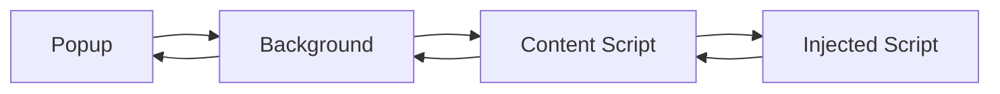

# AdTool Pro Extension

**Extension tự động tách và kích hoạt tài khoản quảng cáo Facebook**

## 📋 Mô tả

AdTool Pro Extension là một công cụ mạnh mẽ được thiết kế để tự động hóa quá trình tách và kích hoạt tài khoản quảng cáo Facebook. Extension hoạt động hoàn toàn trong popup riêng biệt, không làm phiền người dùng khi đang làm việc trên trang web.

## ✨ Tính năng chính

### 🔧 Tách tài khoản quảng cáo

- Tự động tách tài khoản quảng cáo từ Business Manager
- Xử lý song song với số lượng tùy chỉnh
- Theo dõi tiến trình real-time
- Dừng/tiếp tục linh hoạt

### 🔓 Kích hoạt tài khoản

- Tự động kích hoạt lại các tài khoản đã tách
- Xử lý batch với tốc độ cao
- Thông minh bỏ qua tài khoản đã hoạt động
- Tích hợp liền mạch sau quá trình tách

### ⚙️ Cấu hình linh hoạt

- Số lượng tài khoản mục tiêu
- Ngưỡng thất bại tối đa
- Thời gian delay tùy chỉnh
- Số lượng xử lý đồng thời

### 🔧 Cài đặt nâng cao

- **Tự động mở tab**: Tự động mở Business Manager với Business ID
- **Lịch chạy tự động**: Lên lịch chạy theo thời gian trong ngày
- **Lưu cài đặt**: Tự động lưu và khôi phục cài đặt

## 🎨 Giao diện

### Tab System

- **Tab "Khởi Chạy"**: Dashboard chính với thống kê và điều khiển
- **Tab "Cài Đặt"**: Cấu hình chi tiết và cài đặt nâng cao

### Real-time Monitoring

- Progress bars trực quan
- Thống kê chi tiết
- Status indicator với animation
- Thông báo real-time

## 🚀 Cài đặt

### Yêu cầu hệ thống

- Google Chrome (phiên bản 88+)
- Tài khoản Facebook Business Manager
- Quyền quản lý tài khoản quảng cáo

### Hướng dẫn cài đặt

1. **Tải extension**

   ```bash
   git clone [repository-url]
   cd extension
   ```

2. **Cài đặt trong Chrome**

   - Mở Chrome và truy cập `chrome://extensions/`
   - Bật "Developer mode"
   - Click "Load unpacked" và chọn thư mục extension

3. **Cấu hình ban đầu**
   - Mở Facebook Business Manager
   - Click vào icon extension
   - Cấu hình các thông số cần thiết

## 📖 Hướng dẫn sử dụng

### Bắt đầu nhanh

1. **Mở Business Manager**

   - Đăng nhập vào Facebook Business Manager
   - Đảm bảo có quyền quản lý tài khoản quảng cáo

2. **Cấu hình extension**

   - Click vào icon extension
   - Chuyển sang tab "Cài Đặt"
   - Điều chỉnh các thông số theo nhu cầu

3. **Bắt đầu quá trình**
   - Quay lại tab "Khởi Chạy"
   - Click "Bắt Đầu" để khởi động

### Cài đặt nâng cao

#### Tự động mở tab

```javascript
// Bật tính năng tự động mở tab
// Nhập Business ID vào trường tương ứng
// Extension sẽ tự động mở: https://business.facebook.com/latest/settings/business_users?business_id=YOUR_BUSINESS_ID
```

#### Lịch chạy tự động

```javascript
// Bật lịch chạy tự động
// Chọn các khung giờ mong muốn (09:00, 14:00, 19:00, 22:00)
// Extension sẽ tự động chạy tại các thời điểm đã cấu hình
```

## 🏗️ Kiến trúc kỹ thuật

### Cấu trúc file

```
extension/
├── manifest.json          # Cấu hình extension
├── popup.html            # Giao diện popup
├── popup.js              # Logic popup
├── background.js         # Service worker
├── content.js            # Content script
├── injected.js           # Core logic
└── README.md             # Tài liệu
```

### Luồng hoạt động

1. **Popup** ↔ **Background Script** ↔ **Content Script** ↔ **Injected Script**
2. **Background Script** quản lý communication và tab management
3. **Content Script** inject core logic vào Facebook page
4. **Injected Script** thực hiện các API calls và xử lý dữ liệu

### Communication Flow



## ⚙️ Cấu hình chi tiết

### Cài đặt cơ bản

- **Số tài khoản thành công cần tách**: Mục tiêu số lượng tài khoản cần tách
- **Số tài khoản xử lý đồng thời**: Số lượng request song song
- **Ngưỡng thất bại tối đa**: Số lần thất bại trước khi chuyển sang kích hoạt
- **Thời gian delay trước khi kích hoạt**: Delay giữa tách và kích hoạt
- **Số tài khoản kích hoạt đồng thời**: Batch size cho kích hoạt

### Cài đặt nâng cao

- **Tự động mở tab**: Tự động mở Business Manager khi khởi chạy
- **Business ID**: ID của Business Manager để mở tab tự động
- **Lịch chạy tự động**: Bật/tắt tính năng lên lịch
- **Khung giờ**: Các thời điểm tự động chạy trong ngày

## 🔒 Bảo mật

### Quyền truy cập

- **Storage**: Lưu cài đặt người dùng
- **Tabs**: Quản lý tab Facebook
- **Active Tab**: Truy cập tab hiện tại
- **Host Permissions**: Chỉ truy cập Facebook domains

### Bảo vệ dữ liệu

- Không thu thập thông tin cá nhân
- Cài đặt được lưu locally
- Không gửi dữ liệu ra bên ngoài

## 🐛 Xử lý lỗi

### Lỗi thường gặp

1. **"Không tìm thấy tab Facebook Business Manager"**

   - Đảm bảo đã mở trang business.facebook.com
   - Refresh trang nếu cần

2. **"Lỗi khi bắt đầu quá trình"**

   - Kiểm tra quyền quản lý tài khoản
   - Đảm bảo đã đăng nhập Facebook

3. **"Timeout waiting for response"**
   - Refresh trang Facebook
   - Thử lại sau vài giây

### Debug mode

```javascript
// Bật debug mode trong console
localStorage.setItem("adtoolProDebug", "true");
```

## 📊 Hiệu suất

### Benchmarks

- **Tách tài khoản**: 200-500 tài khoản/phút
- **Kích hoạt tài khoản**: 50-100 tài khoản/phút
- **Memory usage**: < 50MB
- **CPU usage**: < 10%

### Tối ưu hóa

- Xử lý song song với batch size tùy chỉnh
- Delay thông minh giữa các request
- Cleanup resources tự động
- Error handling robust

## 🤝 Đóng góp

### Báo cáo lỗi

- Tạo issue với mô tả chi tiết
- Đính kèm log lỗi nếu có
- Mô tả steps để reproduce

### Đóng góp code

1. Fork repository
2. Tạo feature branch
3. Commit changes
4. Tạo Pull Request

## 📄 License

Copyright © 2024 HASoftware - Ads Solution
Liên hệ: @HoangAnhDev

## 📞 Hỗ trợ

- **Telegram**: @HoangAnhDev
- **Email**: [contact@hasoftware.com]
- **Documentation**: [link-to-docs]

---

**HASoftware - Ads Solution - Auto Version**
_Công cụ tự động hóa quảng cáo Facebook hàng đầu_
